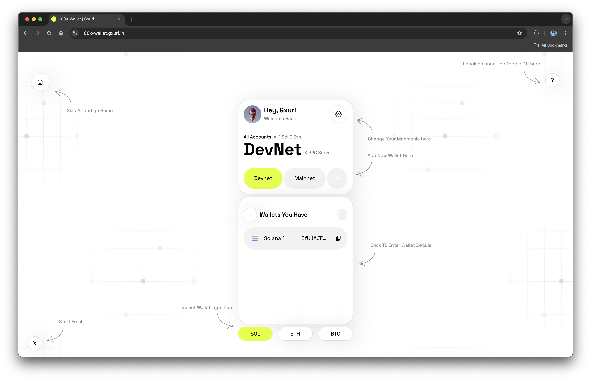
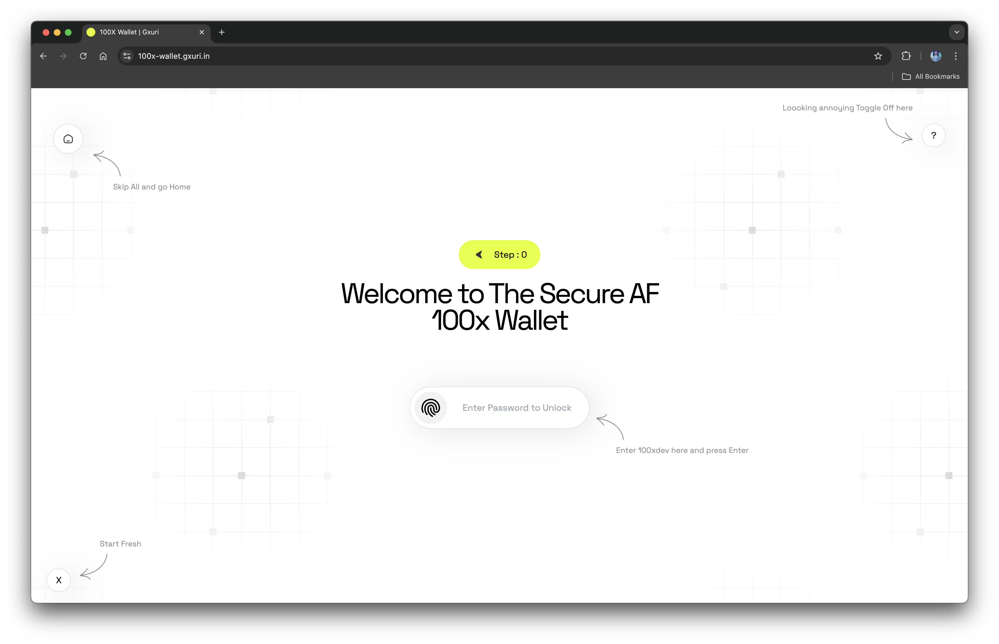
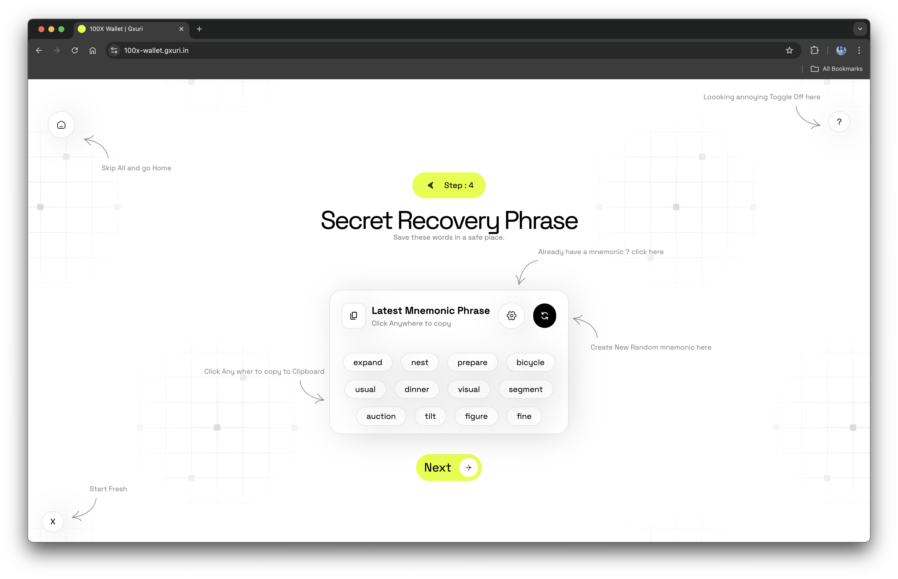
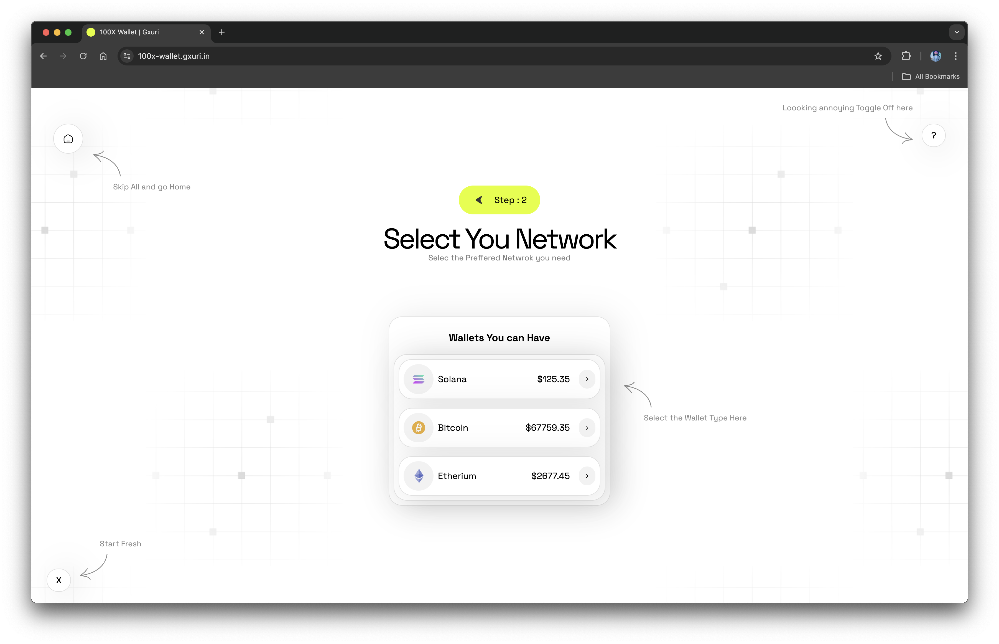
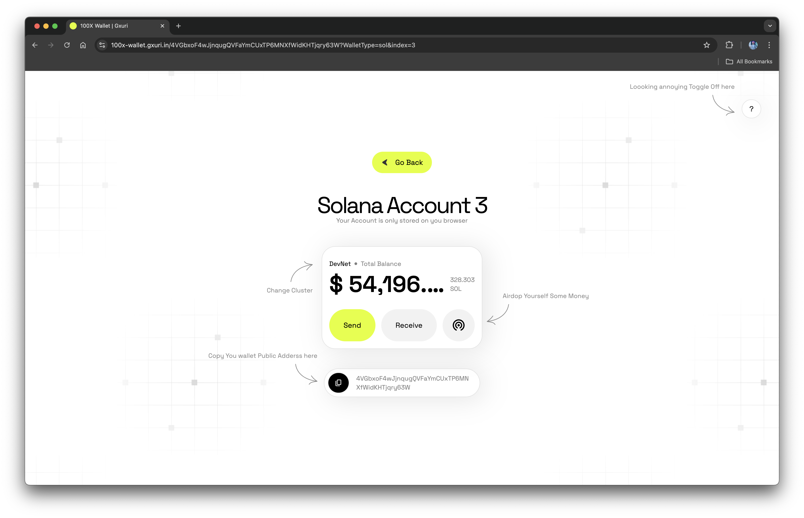

## What is 100xWallet?

## Introduction

100x Wallet is a Web3 wallet generator that creates wallets based on mnemonic phrases. It allows users to generate new wallets or import existing ones, without storing private keys. The wallets are password-protected, ensuring secure access without compromising private key storage.

#### User Workflow

1. The user generates a wallet using the 100xDev app.
2. The user can import existing wallets using a derived path.
3. The user can send SOL to other accounts.
4. The user can view the wallet balance.

#### How it Works

- Password Protection: Secure your wallet with a password for added security.
- Wallet Generation: Create a new wallet with a randomly generated mnemonic phrase.
- Import Existing Wallets: Import wallets from existing ones using a derived path.
- Fetch Wallet Balance: Easily retrieve and display wallet balances.
- Airdrop Money (Beta): Receive airdropped funds (limited to Solana) once per hour.
- Send SOL to other accounts

#### Tech Stack

- React.js
- Tailwindcss
- Solana web3js
- bip39
- ed25519-hd-key
- tweetnacl

#### UI/UX

 

  
  
  
  
  

  

## Open-Source and No Hidden Costs

100x Wallet is an open-source project, and we are committed to keeping it that way. The application does not connect to any servers or third-party services, ensuring privacy and transparency.

## Get Involved

We welcome contributions from the community to further enhance the 100xwallet ecosystem. Whether you're a developer, designer, or an enthusiast, there are numerous ways to get involved. Visit our [GitHub repository](https://github.com/Gurvinder-Singh02/100x-Wallet) to explore the codebase, submit issues, or contribute to the project.

## Stay Connected

Stay up-to-date with the latest developments, announcements, and updates from the 100xDev team by following us on social media:

- Twitter: [@guri_who](https://twitter.com/guri_who)
