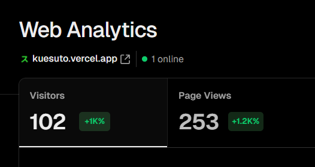

## What is Kuesuto?

<br />
<video
  muted
  autoPlay
  loop
  className="w-full aspect-video"
  poster="./assets/kuesuto/og.jpg"
>
  <source src="https://res.cloudinary.com/dv6t6t4lp/video/upload/v1753463725/kuesuto.mp4" />
</video>

## Introduction

Kuesuto is an innovative AI-powered quiz application built with Next.js, designed to let users generate and take custom quizzes on any topic of their choice. Whether you're curious about "world history" or diving deep into "quantum physics," Kuesuto uses AI (powered by `@google/generative-ai`) to create tailored 10-question quizzes in seconds. With a sleek interface built on shadcn components, seamless authentication via NextAuth (supporting Google, GitHub, and credentials-based login), and responsive design with Tailwind CSS, Kuesuto offers an engaging and intuitive learning experience. The project has been optimized for SEO with meta tags, sitemap.xml, robots.txt, and Google site verification, ensuring visibility and accessibility.

## Why Kuesuto?

Learning should be fun, interactive, and accessible! I built Kuesuto to make knowledge exploration exciting and personalized. Tired of generic quiz apps? Kuesuto lets you pick any topic, and our AI crafts a unique quiz just for you. The developer community has shown amazing support, and I’m thrilled to see how it’s sparking curiosity worldwide!


Kuesuto leverages a rich set of shadcn-based components, including:
- **QuizInput**: A form component for users to input their desired quiz topic.
- **Navbar**: A responsive navigation bar for seamless user experience.
- **Card**: Displays quiz questions and answers in a clean, modern layout.
- **Timeline**: Showcases the quiz journey or app features interactively.
- **Accordion**: Used for expandable content, such as FAQs or quiz instructions.
- **Button**: Interactive buttons with animations for quiz navigation and submission.

## Features

1. **AI-Powered Quiz Generation**: Enter any topic, and Kuesuto’s AI (powered by `@google/generative-ai`) generates a 10-question quiz tailored to your interests.
2. **Seamless Authentication**: Supports Google, GitHub, and credentials-based login via NextAuth for a secure and personalized experience.
3. **Responsive Design**: Built with Tailwind CSS and shadcn components, ensuring a consistent and modern UI across all devices.
4. **Customizable UI**: Easily adapt components to match your branding or preferences using Tailwind’s utility classes.
5. **Interactive Components**: Includes animations (via `framer-motion`) and responsive elements like accordions, cards, and timelines.
6. **SEO Optimized**: Includes sitemap.xml, robots.txt, meta tags, and Google site verification for better discoverability.
7. **Real-Time Analytics**: Integrated with Vercel Analytics and Speed Insights for performance tracking.
8. **Modern UI/UX**:
   - Fully responsive for mobile, tablet, and desktop
   - Dark/Light theme support via Tailwind’s `darkMode`
   - Accessible components built with Radix UI
   - Smooth animations for an engaging experience

## How to Use

Kuesuto is built with Next.js and shadcn, making it easy to set up and integrate into your projects. Follow these steps to get started:

1. **Clone the Repository**:
   ```bash
   git clone https://github.com/shaah1d/Kuesuto.git
   ```

2. **Install Dependencies**:
   ```bash
   cd Kuesuto
   npm install
   ```

3. **Set Up Environment Variables**:
   Create a `.env.local` file and add your Google and GitHub OAuth credentials and Google Generative AI API key:
   ```bash
   GOOGLE_ID=your_google_client_id
   GOOGLE_SECRET=your_google_client_secret
   GITHUB_ID=your_github_client_id
   GITHUB_SECRET=your_github_client_secret
   GOOGLE_GENERATIVE_AI_API_KEY=your_api_key
   ```

4. **Run the Development Server**:
   ```bash
   npm run dev
   ```

5. **Start Quizzing**:
   - Visit `http://localhost:3000` in your browser.
   - Sign in using Google, GitHub, or credentials.
   - Enter a topic in the quiz input form, and let the AI generate your quiz!

#### User Workflow

1. Users sign in via Google, GitHub, or email/password.
2. Enter a topic of interest in the `QuizInput` component.
3. The app generates a 10-question quiz using AI.
4. Users answer questions displayed in interactive `Card` components.
5. View results and track progress with a celebratory `Finished` component (featuring `canvas-confetti` animations).
6. Explore additional pages like “About” and “How It Works” for more context.
7. Customize the UI by tweaking Tailwind classes or shadcn components.

## Numbers Don't Lie

WOW! Kuesuto has been sparking curiosity across the globe! 🚀🔥 The community’s response has been incredible, with thousands exploring their knowledge through custom quizzes.

<br />
<div className="flex flex-col justify-between w-full">
  
</div>


The excitement is real! Launched recently, Kuesuto has already ignited a passion for learning. Stay tuned for more stats as we grow!

## Show Some Support

Love Kuesuto? Support us on Product Hunt!

{' '}

<a
  href="https://www.producthunt.com/products/kuesuto?embed=true&utm_source=badge-featured&utm_medium=badge&utm_source=badge-kuesuto"
  target="_blank"
  rel="noopener noreferrer"
>
  
</a>


## Get Involved

I welcome contributions from the community to make Kuesuto even better! Whether you're a developer, designer, or quiz enthusiast, there are many ways to contribute. Visit the application [GitHub repository](https://github.com/shaah1d/Kuesuto) to explore the codebase, submit issues, or add new features.

## Stay Connected

Stay updated with Kuesuto’s latest features, announcements, and quizzes by following us on social media:

- X: [@shaah1d](https://x.com/shaah1d)
- GitHub: [shaah1d/Kuesuto](https://github.com/shaah1d/Kuesuto)
- YouTube: [Watch our introduction video](https://youtu.be/fmPXLgpq8Vc)
---