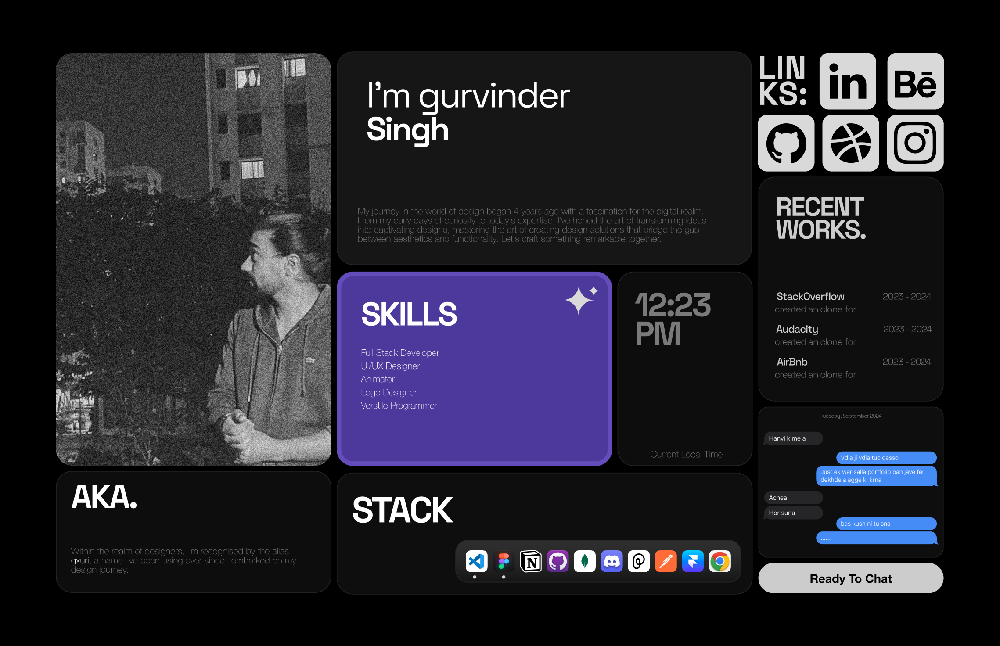

## UI/UX Portfolio Promo

<video
  className="w-full aspect-video"
  poster="./assets/uiportfolio/port.png"
  autoPlay
  loop
  muted
>
  <source src="https://d2glbkh3xawr9t.cloudfront.net/gxuri.mp4" />
</video>

## Introduction

A collection of my UI/UX projects showcasing my skills in design and development
This portfolio showcases my passion for creating smooth, modern user experiences through thoughtful design and cutting-edge technologies. I've leveraged powerful libraries and frameworks to create engaging interactions:

### Modern Animation & Interactions

- **Framer Motion** for fluid page transitions and micro-interactions
- Smooth scroll animations that respond to user viewport
- Parallax effects and gesture-based animations
- Seamless dark/light theme transitions

### Performance & Best Practices 

- Next.js 14 with server components for optimal loading
- Image optimization and lazy loading
- Responsive layouts using Tailwind CSS
- Accessibility-first approach with ARIA labels and semantic HTML

 

    

### Design Philosophy

#### My design approach focuses on:
- Clean, minimalist aesthetics
- Intuitive navigation patterns
- Thoughtful use of white space
- Consistent visual hierarchy
- Engaging micro-interactions

## Features

1. Immersive 3D scenes and models powered by Three.js with interactive elements and smooth transitions

2. Fluid user interface with seamless animations and gesture-based interactions using Framer Motion

3. Elegant dark mode implementation with system preference detection and smooth theme transitions

4. Delightful micro-animations for hover states, loading indicators, and interactive elements

5. Comprehensive SEO optimization with meta tags, semantic HTML, and performance enhancements

6. Responsive layouts with dynamic content loading and modern UI components

7. Server-side rendering with Next.js 14 for optimal performance and user experience

#### Tech Stack

- Next.js
- Framer Motion
- Shadcn/ui
- TypeScript
- Tailwind CSS

## Stay Connected

Stay up-to-date with the latest developments, announcements, and updates from the Fix My Code team by following us on social media:

- Twitter: [@guri_who](https://twitter.com/guri_who)
