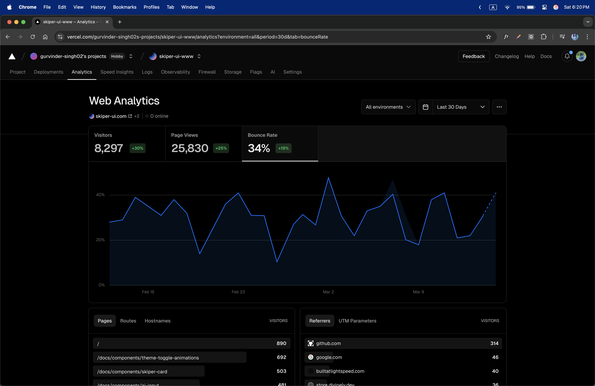

## What is Skiper UI?

<br />
<video
  muted
  autoPlay
  loop
  className="w-full aspect-video"
  poster="./assets/skiperui/og.png"
>
  <source src="https://d2glbkh3xawr9t.cloudfront.net/skiper-ui.mov" />
</video>

## Introduction

Skiper UI is a modern UI library for Next.js components that streamlines the development process. With over 25,000 user views in the last 30 days, it provides sleek, ready-to-use components that can be implemented with simple copy-paste functionality. Built on top of shadcn, Skiper UI offers a comprehensive collection of components that save development time while maintaining high-quality design standards.

## Why Skiper UI?

I was bored seeing every website look the same with shadcn. We needed a change! So I built one because I thought it was a cool thing to do.

The amazing response? I love the dev community so much - can't believe the amount of love it's received!

## Some Components

<br />
<div className="flex flex-wrap gap-5 justify-center w-full">
  
  
  
  
  
  
</div>

## Features

1. Pre-built Components: Access a growing library of modern, responsive UI components designed specifically for Next.js projects.

2. One-Command Installation: Add components to your project with a simple NPX command: `npx shadcn@latest add "http://skiper-ui.com/registry/<component-name>"`.

3. Seamless Integration: Components designed to work perfectly with Next.js and existing project structures.

4. Customizable Design: Easily modify components to match your brand identity and design requirements.

5. Ready-to-Use Code: Copy-paste implementation that requires minimal configuration.

6. Component Consistency: Unified design language across all components for a cohesive user experience.

7. Modern UI/UX:
   - Responsive design for all devices
   - Dark/Light theme support
   - Accessible components
   - Intuitive animations

## How to Use

Built on top of the shadcn CLI so that users can trust it. Just one command and the component is all yours!

```bash
npx shadcn@latest add "http://skiper-ui.com/registry/<component-name>"
```

Get started now: [Skiper UI](https://skiper-ui.com/)

#### User Workflow

1. The user can install components with a single command.
2. The user can copy and paste component code into their Next.js project.
3. The user can customize components to match design requirements.
4. The user can build responsive interfaces quickly.
5. The user can browse the component library for inspiration.
6. The user can combine multiple components to create complex layouts.
7. The user can access documentation for implementation details.

## Numbers Don't Lie

DAMMMMMM!!!!!!!!!!! Never thought I'd hit this much reach on my first-ever product! 🚀🔥

<br />
<div className="flex flex-col justify-between w-full">
  
</div>

And the cherry on top? This is just from Feb 2 to Feb 27! 🚀🔥 Launched on Jan 23, and even the first week was LITTTTT! 🔥🔥

Gotta pay Vercel to see last month's stats—not happening for now! 😅😂

Skiper UI is designed with developers in mind, offering a transparent and efficient way to build modern interfaces. Our components are meticulously crafted to provide the perfect balance between functionality and aesthetics.

## Show Some Support

Love Skiper UI? Support us on Product Hunt!

{' '}

<a
  href="https://www.producthunt.com/posts/skiper-ui?embed=true&utm_source=badge-featured&utm_medium=badge&utm_souce=badge-skiper&#0045;ui"
  target="_blank"
>
  
</a>

## Get Involved

We welcome contributions from the community to further enhance the Skiper UI ecosystem. Whether you're a developer, designer, or an enthusiast, there are numerous ways to get involved. Visit our GitHub repository (coming soon) to explore the codebase, submit issues, or contribute to the project.

## Stay Connected

Stay up-to-date with the latest developments, announcements, and updates from the Skiper UI team by following us on social media:

- Twitter: [@guri_who](https://twitter.com/guri_who)
- YouTube: [Watch our introduction video](https://www.youtube.com/watch?v=YuINmZkAViU)
